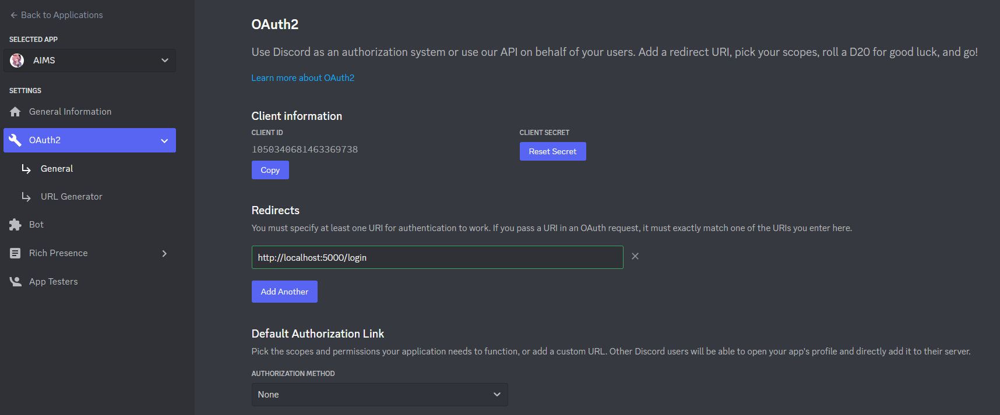

# Setting up Discord OAuth

1. Go to your [Discord applications dashboard](https://discord.com/developers/applications) and create a new application.

2. Go to the OAuth2 > General page and copy down your client ID and client secret.

3. Add a redirect URI to the `/login` endpoint of this API.

Now you can put the client ID and secret into `config.json`, done!
