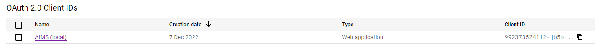
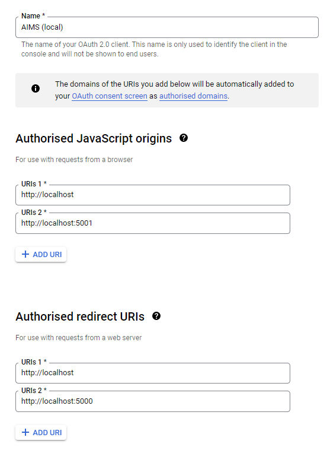
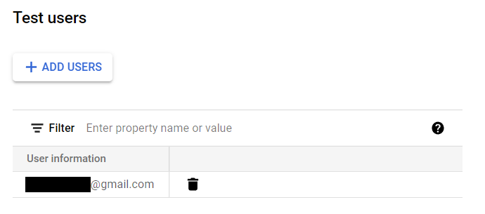

# Setting up Google OAuth

You'll want to follow the instructions from the [Google docs](https://developers.google.com/identity/gsi/web/guides/get-google-api-clientid).

Your [credentials](https://console.cloud.google.com/apis/credentials) page should look something like this:

The **JavaScript origins** are the websites that are allowed to show the "sign in with Google" button.

The **Authorised redirect URIs** are the URIs that the button can redirect the user to after they sign in.

You will also need to set up the OAuth consent screen, the only fields you _need_ to fill out are:

-   App name.
-   User support email.
-   Test users.
-   Developer contact information.

Make sure the email you will be using for testing is in the **test users** table as well:

There are now 2 ways you can login with google:

1. Using the [VSCode live server extension](https://marketplace.visualstudio.com/items?itemName=ritwickdey.LiveServer) you can navigate to the [googleLogin.html](../../static/googleLogin.html) file.

2. Running the API and navigating to [http://localhost:PORT/static/googleLogin.html](http://localhost:5000/static/googleLogin.html), where `PORT` is the port in [config.json](../../config.json) (default 5000).
